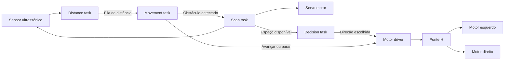

# Pico FreeRTOS Cart

Firmware de um carrinho autônomo para Raspberry Pi Pico, desenvolvido em C com FreeRTOS.

O sistema utiliza um sensor ultrassônico montado sobre um servo motor para detectar obstáculos e analisar o espaço disponível à esquerda e à direita. A movimentação é realizada por dois motores DC controlados por uma ponte H, com direção independente e controle de velocidade por PWM.

## Funcionalidades

- Navegação autônoma com desvio de obstáculos
- Controle diferencial de dois motores DC
- Controle de direção por ponte H
- Controle de velocidade por PWM
- Varredura do ambiente com servo motor
- Medição de distância com sensor ultrassônico
- Execução concorrente com FreeRTOS
- Comunicação entre tarefas com filas e notificações
- Proteção do sensor ultrassônico com mutex
- Parada segura em caso de falha ou ausência de leitura
- Configuração centralizada de pinos e parâmetros

## Arquitetura



A aplicação é dividida em quatro tarefas principais:

| Tarefa | Prioridade | Responsabilidade |
|---|---:|---|
| `distance` | 3 | Executa medições periódicas com o sensor ultrassônico |
| `movement` | 2 | Controla o avanço e interrompe o movimento diante de obstáculos |
| `scan` | 2 | Posiciona o servo e mede o espaço disponível em diferentes ângulos |
| `decision` | 2 | Compara os lados e executa a manobra escolhida |

## Fluxo de navegação

1. O sensor ultrassônico mede continuamente a distância à frente.
2. Enquanto o caminho estiver livre, os dois motores avançam.
3. Quando um obstáculo é detectado, os motores são frenados.
4. O servo movimenta o sensor entre os limites configurados.
5. As distâncias observadas à esquerda e à direita são comparadas.
6. O carrinho gira para o lado com maior espaço disponível.
7. O sensor retorna à posição central e o movimento é retomado.

## Hardware

- Raspberry Pi Pico com RP2040
- Sensor ultrassônico HC-SR04
- Servo motor SG90 ou equivalente
- Dois motores DC
- Ponte H com entradas independentes de direção e PWM
- Fonte externa compatível com os motores

Os motores não devem ser alimentados diretamente pelos GPIOs da Raspberry Pi Pico. A alimentação dos motores deve passar pela ponte H, mantendo o terra da fonte e o terra da placa em comum.

O pino `ECHO` do HC-SR04 normalmente trabalha com nível lógico de 5 V. Deve ser utilizado um divisor resistivo ou conversor de nível para proteger a entrada de 3,3 V da Raspberry Pi Pico.

## Pinagem

A pinagem padrão está definida em `inc/robot_config.h`.

| Componente | Sinal | GPIO |
|---|---|---:|
| Servo | PWM | 16 |
| Sensor ultrassônico | Trigger | 10 |
| Sensor ultrassônico | Echo | 11 |
| Motor esquerdo | IN1 | 2 |
| Motor esquerdo | IN2 | 3 |
| Motor esquerdo | PWM | 4 |
| Motor direito | IN1 | 6 |
| Motor direito | IN2 | 7 |
| Motor direito | PWM | 8 |

A inversão lógica de cada motor pode ser configurada individualmente:

```c
#define ROBOT_LEFT_MOTOR_INVERTED 0
#define ROBOT_RIGHT_MOTOR_INVERTED 1
```

Isso permite corrigir a orientação física dos motores sem alterar a lógica de navegação.

## Estrutura do projeto

```text
pico-freertos-cart/
├── inc/
│   ├── app_tasks.h
│   ├── motor_driver.h
│   ├── robot_config.h
│   ├── servo.h
│   └── ultrasonic.h
├── src/
│   ├── app_tasks.c
│   ├── main.c
│   ├── motor_driver.c
│   ├── servo.c
│   └── ultrasonic.c
├── CMakeLists.txt
├── FreeRTOSConfig.h
└── README.md
```

## Módulos

### `motor_driver`

Responsável pelo controle da ponte H, incluindo:

- movimento para frente;
- movimento em marcha à ré;
- giro sobre o próprio eixo;
- controle independente dos motores;
- frenagem;
- parada em roda livre;
- velocidade por PWM.

### `ultrasonic`

Responsável pela geração do pulso de trigger, medição do tempo do echo e conversão do tempo de propagação em distância.

O módulo também trata timeout e leituras fora da faixa válida.

### `servo`

Responsável pela geração do sinal PWM de 50 Hz utilizado para posicionar o sensor ultrassônico.

### `app_tasks`

Contém as tarefas da aplicação, filas, notificações e mecanismos de sincronização utilizados pelo FreeRTOS.

### `robot_config`

Centraliza:

- pinagem;
- velocidades;
- limites de distância;
- ângulos de varredura;
- intervalos de execução;
- prioridades das tarefas.

### `main`

Inicializa os periféricos, cria os recursos da aplicação e inicia o escalonador do FreeRTOS.

## Controle dos motores

A função principal do driver recebe valores entre `-1.0` e `1.0`:

```c
motor_driver_set(left_speed, right_speed);
```

O sinal define a direção e o módulo define o duty cycle do PWM:

| Valor | Comportamento |
|---:|---|
| `1.0` | Velocidade máxima para frente |
| `0.5` | Metade da velocidade para frente |
| `0.0` | Motor parado |
| `-0.5` | Metade da velocidade em marcha à ré |
| `-1.0` | Velocidade máxima em marcha à ré |

Também estão disponíveis operações de alto nível:

```c
motor_driver_forward(0.70f);
motor_driver_reverse(0.60f);
motor_driver_turn_left(0.65f);
motor_driver_turn_right(0.65f);
motor_driver_stop(MOTOR_STOP_BRAKE);
```

## Configurações principais

Os parâmetros de navegação podem ser alterados em `inc/robot_config.h`.

```c
#define ROBOT_CRUISE_SPEED 0.70f
#define ROBOT_TURN_SPEED 0.65f

#define ROBOT_OBSTACLE_THRESHOLD_CM 20.0f

#define ROBOT_SCAN_MIN_ANGLE 20
#define ROBOT_SCAN_MAX_ANGLE 160
#define ROBOT_SCAN_STEP_ANGLE 10

#define ROBOT_TURN_DURATION_MS 500
```

As velocidades são representadas por valores entre `0.0` e `1.0`.

## Dependências

- Raspberry Pi Pico SDK
- FreeRTOS Kernel com suporte ao RP2040
- CMake
- Toolchain GNU Arm Embedded

## Compilação

Defina os caminhos das dependências:

```bash
export PICO_SDK_PATH="$HOME/micro_ros_ws/src/pico-sdk"
export FREERTOS_KERNEL_PATH="$HOME/micro_ros_ws/src/FreeRTOS-Kernel"
```

Configure o projeto:

```bash
cmake -S . -B build
```

Compile:

```bash
cmake --build build --parallel
```

Os principais arquivos gerados estarão disponíveis em:

```text
build/pico_freertos_cart.elf
build/pico_freertos_cart.uf2
```

## Gravação na Raspberry Pi Pico

1. Desconecte a placa do computador.
2. Mantenha o botão `BOOTSEL` pressionado.
3. Conecte a placa pela porta USB.
4. Solte o botão quando a unidade `RPI-RP2` aparecer.
5. Copie `build/pico_freertos_cart.uf2` para a unidade.

## Tratamento de falhas

O firmware adota um comportamento seguro em situações como:

- timeout na leitura do sensor ultrassônico;
- ausência de novas medições;
- falha na criação de filas, mutexes ou tarefas;
- falha na alocação dinâmica do FreeRTOS;
- estouro de pilha de uma tarefa.

Nessas situações, os motores são interrompidos para evitar movimentação sem uma leitura válida do ambiente.

## Estado do projeto

- Arquitetura modular
- Controle de motores por ponte H e PWM
- Aplicação concorrente com FreeRTOS
- Build verificado com Pico SDK e FreeRTOS
- Compilação concluída sem warnings ou erros
